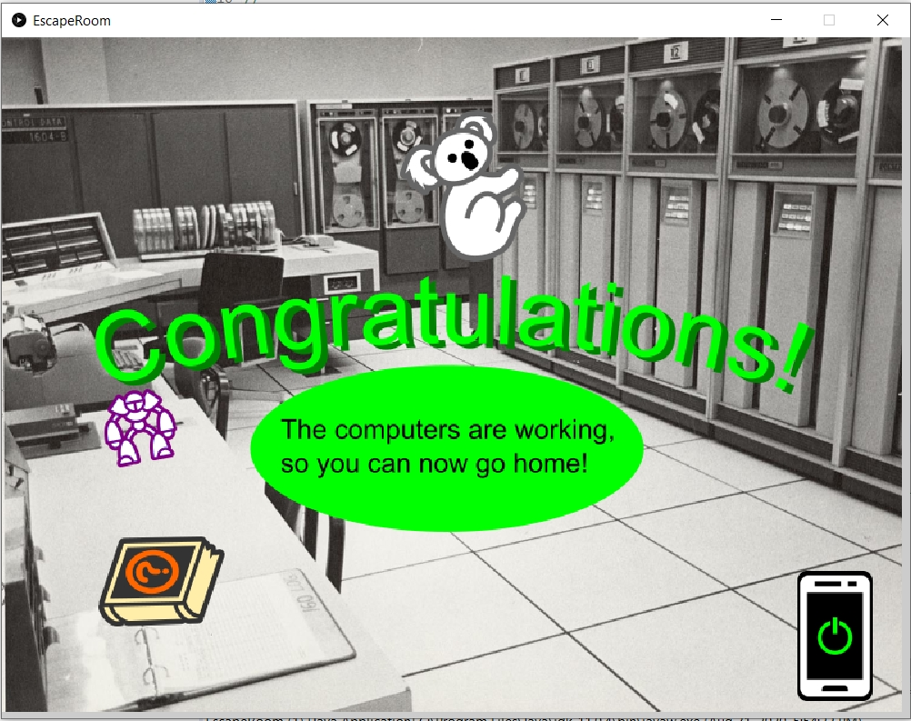

# EscapeRoom
Escape room is one of my favorite games. You have to uses items in proper place to escape the room. Some items might be hidden, so you have to find them in someplace.\
Try compete with your friend who can eacape faster!!!

# How to play
- Run the app
- Apply items into desired places (Some items have to be found)
- If you get message like the above image, you are escaped!!!

# implementation
This project required understand of object orientaion programming in Java. I implemented Thing object which is item, but does not have any functions. From Thing object, I implemented visible thing which can be visible in the game. By extending visible thing, created clickable thing. Finally, implemented draggable thing from clickable thing.

# Technique
- Object Oriented Programming
